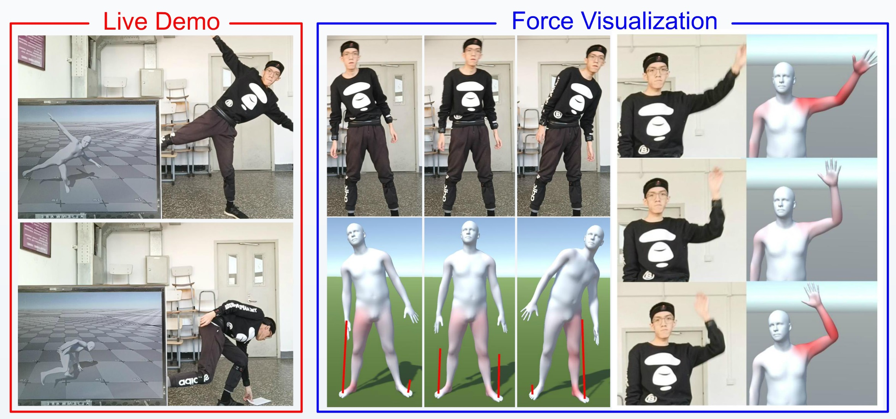

# PIP

Code for our CVPR 2022 [paper](https://arxiv.org/abs/2203.08528) "Physical Inertial Poser (PIP): Physics-aware Real-time Human Motion Tracking from Sparse Inertial Sensors". This repository contains the system implementation and evaluation.  See [Project Page](https://xinyu-yi.github.io/PIP/).



## Usage

### Install dependencies

We use `python 3.7.6`. You should install the newest `pytorch chumpy vctoolkit open3d pybullet qpsolvers cvxopt`.

You also need to compile and install [rbdl](https://github.com/rbdl/rbdl) with python bindings. Also install the urdf reader addon. This library is easy to compile on Linux. For Windows, you need to rewrite some codes and the CMakeLists. We have only tested our system on Windows.

*If the newest `vctoolkit` reports errors, please use `vctoolkit==0.1.5.39`.*

*Installing `pytorch` with CUDA is recommended but not mandatory. During evaluation, the motion prediction can run at ~120fps on CPU, but computing the errors may be very slow without CUDA.*

```
pip install torch==1.8.2 torchvision==0.9.2 torchaudio===0.8.2 --extra-index-url https://download.pytorch.org/whl/lts/1.8/cu111
```

*If you have configured [TransPose](https://github.com/Xinyu-Yi/TransPose/), just use its environment and install the missing packages including the `rbdl`.*

### Prepare SMPL body model

1. Download SMPL model from [here](https://smpl.is.tue.mpg.de/). You should click `SMPL for Python` and download the `version 1.0.0 for Python 2.7 (10 shape PCs)`. Then unzip it.
2. In `config.py`, set `paths.smpl_file` to the model path.

*If you have configured [TransPose](https://github.com/Xinyu-Yi/TransPose/), just copy its settings here.*

### Prepare physics body model

1. Download the physics body model from [here](https://xinyu-yi.github.io/PIP/files/urdfmodels.zip) and unzip it.
2. In `config.py`, set `paths.physics_model_file` to the body model path.
3. In `config.py`, set `paths.plane_file`  to `plane.urdf`. Please put `plane.obj` next to it.

*The physics model and the ground plane are modified from [physcap](https://github.com/soshishimada/PhysCap_demo_release).*

### Prepare pre-trained network weights

1. Download weights from [here](https://xinyu-yi.github.io/PIP/files/weights.pt).
2. In `config.py`, set `paths.weights_file` to the weights path.

### Prepare test datasets

1. Download DIP-IMU dataset from [here](https://dip.is.tue.mpg.de/). We use the raw (unnormalized) data.
2. Download TotalCapture dataset from [here](https://cvssp.org/data/totalcapture/). You need to download `the real world position and orientation` under `Vicon Groundtruth` in the website and unzip them. The ground-truth SMPL poses used in our evaluation are provided by the DIP authors. So you may also need to contact the DIP authors for them.
3. In `config.py`, set `paths.raw_dipimu_dir` to the DIP-IMU dataset path; set `paths.raw_totalcapture_dip_dir` to the TotalCapture SMPL poses (from DIP authors) path; and set `paths.raw_totalcapture_official_dir` to the TotalCapture official `gt` path. Please refer to the comments in the codes for more details.

*If you have configured [TransPose](https://github.com/Xinyu-Yi/TransPose/), just copy its settings here. **Remember**: you need to rerun the `preprocess.py` as the preprocessing of TotalCapture dataset has been changed to remove the acceleration bias.*

### Run the evaluation

You should preprocess the datasets before evaluation:

```
python preprocess.py
python evaluate.py
```

The pose/translation evaluation results for DIP-IMU and TotalCapture test datasets will be printed/drawn.

### About the codes

The authors are too busy to clean up/rewrite the codes. Here are some useful tips:

- In `dynamics.py`, there are many disabled options for the physics optimization. You can try different combinations of the energy terms by enabling the corresponding terms. 

- In Line ~44 in `net.py`:

  ```python
  self.dynamics_optimizer = PhysicsOptimizer(debug=False)
  ```

  set `debug=True` to visualize the estimated motions using pybullet. You may need to clean the cached results and rerun the `evaluate.py`. (e.g., set `flush_cache=True` in `evaluate()` and rerun.)

- In Line ~244 in `dynamics.py`:

  ```python
  if False:   # visualize GRF (no smoothing)
      p.removeAllUserDebugItems()
      for point, force in zip(collision_points, GRF.reshape(-1, 3)):
          p.addUserDebugLine(point, point + force * 1e-2, [1, 0, 0])
  ```

  Enabling this to visualize the ground reaction force. (You also need to set `debug=True` as stated above.) Note that rendering the force lines can be very slow in pybullet. 

- The hyperparameters for the physics optimization are all in `physics_parameters.json`.  If you set `debug=True`, you can adjust these parameters interactively in the pybullet window.

## Contact input format (Route-B surfaces: arbitrary support planes)

`dynamics.py` supports a dict-based `contact` input so you can **manually specify which joints/points are in contact**, the **contact degree** (used to tighten/relax the no-slip constraint), and (Route-B) an **arbitrary contact surface plane** for each joint.

Each joint can provide:
- `c`: contact degree in \([0,1]\) (larger => stricter no-slip)
- `p`: 4-corner mask \([p0,p1,p2,p3]\) (1=active, 0=inactive)
- `n`: surface normal (world) for the contact plane
- `p0`: a point on the contact plane (world)

If `n/p0` are omitted, the solver falls back to the default ground plane `y = floor_y` (i.e., `n=[0,1,0]`, `p0=[0,floor_y,0]`).

Example (chair seat + back support):

```json
{
  "joints": {
    "LFOOT":  { "c": 0.9, "p": [1,1,1,1], "n": [0,1,0], "p0": [0,-0.87,0] },
    "RFOOT":  { "c": 0.9, "p": [1,1,1,1], "n": [0,1,0], "p0": [0,-0.87,0] },

    // chair seat plane (horizontal)
    "LHIP":   { "c": 0.9, "p": [1,1,1,1], "n": [0,1,0], "p0": [0,-0.45,0] },
    "RHIP":   { "c": 0.9, "p": [1,1,1,1], "n": [0,1,0], "p0": [0,-0.45,0] },

    // chair back plane (vertical, normal points forward)
    "SPINE2": { "c": 0.8, "p": [1,1,1,1], "n": [0,0,1], "p0": [0,0,0.25] }
  }
}
```

## Unity connector: GRF payload format

This repo includes a simple socket connector (`unity_connector.py`). The outgoing packet format is:

`pose#tran#grf#tau$`

Where `grf` is now sent as a **JSON string** (when physics is enabled), containing **all active contact points** with their joint names:

```json
{
  "contacts": [
    {"joint":"LFOOT","point":"front-left","force":[0.0,123.4,0.0]},
    {"joint":"LKNEE","point":"point-0","force":[1.2,0.0,3.4]}
  ],
  "left_foot": [
    {"point":"front-left","force":[0.0,0.0,0.0]},
    {"point":"front-right","force":[0.0,0.0,0.0]},
    {"point":"back-left","force":[0.0,0.0,0.0]},
    {"point":"back-right","force":[0.0,0.0,0.0]}
  ],
  "right_foot": [
    {"point":"front-left","force":[0.0,0.0,0.0]},
    {"point":"front-right","force":[0.0,0.0,0.0]},
    {"point":"back-left","force":[0.0,0.0,0.0]},
    {"point":"back-right","force":[0.0,0.0,0.0]}
  ]
}
```

Notes:
- `contacts` is a **fixed-size full list**: for every joint in `test_contact_joints`, we always output 4 corner points (`front-left/front-right/back-left/back-right`). If a point is not active in the QP contact set in this frame, its `force` is `[0,0,0]`.
- `left_foot` / `right_foot` always contain 4 entries each (fixed order), for easy visualization/debug.

Unity (C#) parsing sketch:

```csharp
// packet: pose#tran#grf#tau$
var packet = raw.TrimEnd('$');
var parts = packet.Split('#');
var grfJson = parts[2];

// Recommended: Newtonsoft.Json
// var msg = JsonConvert.DeserializeObject<GrfMsg>(grfJson);

[Serializable] public class GrfMsg { public ContactPoint[] contacts; public FootPoint[] left_foot; public FootPoint[] right_foot; }
[Serializable] public class ContactPoint { public string joint; public string point; public float[] force; }
[Serializable] public class FootPoint { public string point; public float[] force; }
```

## Citation

If you find the project helpful, please consider citing us:

```
@InProceedings{PIPCVPR2022,
  author = {Yi, Xinyu and Zhou, Yuxiao and Habermann, Marc and Shimada, Soshi and Golyanik, Vladislav and Theobalt, Christian and Xu, Feng},
  title = {Physical Inertial Poser (PIP): Physics-aware Real-time Human Motion Tracking from Sparse Inertial Sensors},
  booktitle = {IEEE/CVF Conference on Computer Vision and Pattern Recognition (CVPR)},
  month = {June},
  year = {2022}
}
```

